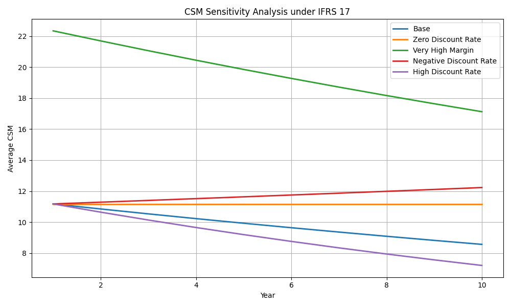

# Modeling the Contractual Service Margin (CSM) under IFRS 17

This project simulates the evolution of the Contractual Service Margin (CSM) under IFRS 17 using synthetic insurance contract data. The goal is to demonstrate how changes in key financial assumption, such as discount rates and profit margin ratios, affect the amortization of the CSM over time.

---

## Objectives

- Implement a simplified structure of IFRS 17 liability measurement.
- Generate synthetic insurance contract data with premiums, claims, and expected service expenses.
- Calculate CSM balances over time using discounted future service margins.
- Perform sensitivity analysis under various financial assumptions.
- Visualize year-by-year changes in average CSM balances.

---
## Tools Used

| Tool / Library     | Purpose                                 |
|--------------------|-----------------------------------------|
| **Python 3.10+**    | Main programming language               |
| **NumPy**           | Numerical operations and simulations    |
| **Pandas**          | Synthetic data generation & management  |
| **Matplotlib**      | Line chart visualization                |
| **OS** (standard lib) | Auto-create folder for plot output     |

---

## Methodology

1. **Synthetic Data Generation**  
   - Simulated 1,000 insurance contracts over a 10-year horizon.
   - Assumed normally distributed premiums and claims.
   - Expected service costs were modeled as 20% of expected claims.

2. **CSM Calculation**  
   - For each contract, the CSM is defined as a portion of the expected service margin (Premium - Claims - Expenses).
   - This margin is amortized over time using a present value formula with varying discount rates.

3. **Sensitivity Scenarios**  
   - The following scenarios were tested to observe their impact on CSM development:

| Scenario                | Discount Rate | Margin Ratio | Description |
|-------------------------|---------------|--------------|-------------|
| Base                    | 3.0%          | 10%          | Standard case for comparison |
| Zero Discount Rate      | 0.0%          | 10%          | No time value of money |
| Very High Margin        | 3.0%          | 20%          | Significantly higher expected profit |
| Negative Discount Rate  | -1.0%         | 10%          | Increasing present value of future service |
| High Discount Rate      | 5.0%          | 10%          | Heavily discounted future margins |

---

## Results

### CSM Sensitivity Analysis

The chart below compares the average CSM balance over 10 years under the five different financial scenarios.

### Key Takeaways

- **Base Case**: The CSM gradually decreases as expected under standard IFRS 17 assumptions.
- **Zero Discount Rate**: Without discounting, the CSM remains nearly constant over time.
- **Very High Margin**: A larger margin ratio produces a much higher initial CSM with a slower decline.
- **Negative Discount Rate**: An unusual case where the CSM increases over time due to the rising present value of future margins.
- **High Discount Rate**: Future margins are deeply discounted, resulting in rapid amortization of the CSM.

---

## Remarks
This project mirrors the conceptual approach used in actuarial modeling and financial reporting under IFRS 17. Though simplified, it provides a useful lens into how changes in assumptions can materially impact liability measurement over time. Simulated CSM development under IFRS 17, highlighting actuarial model implications under financial assumption changes.
